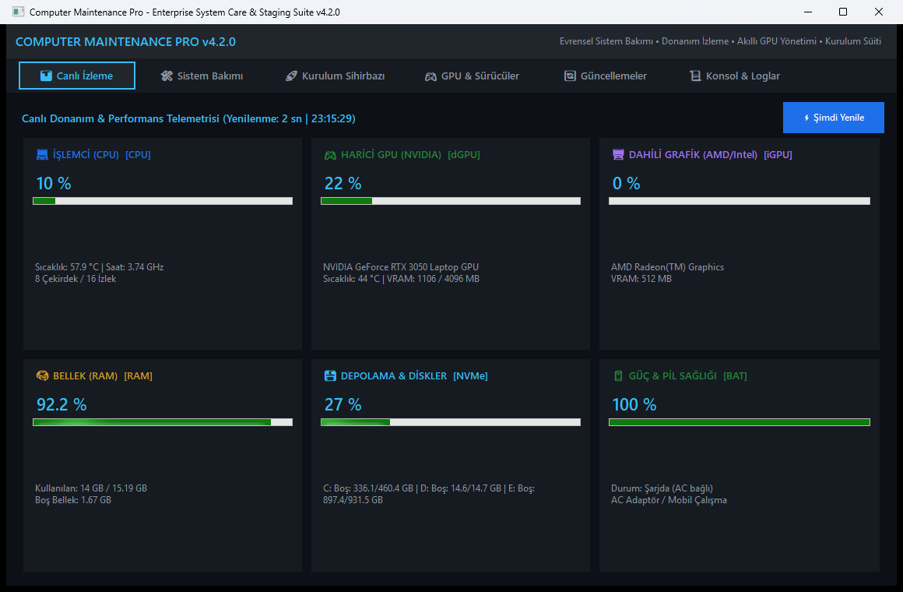
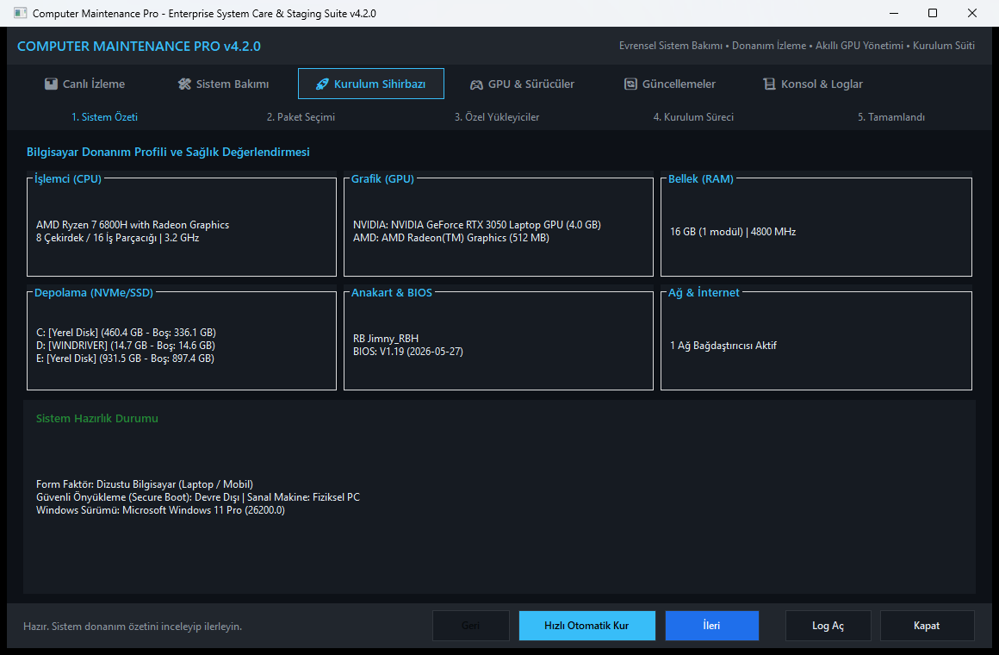
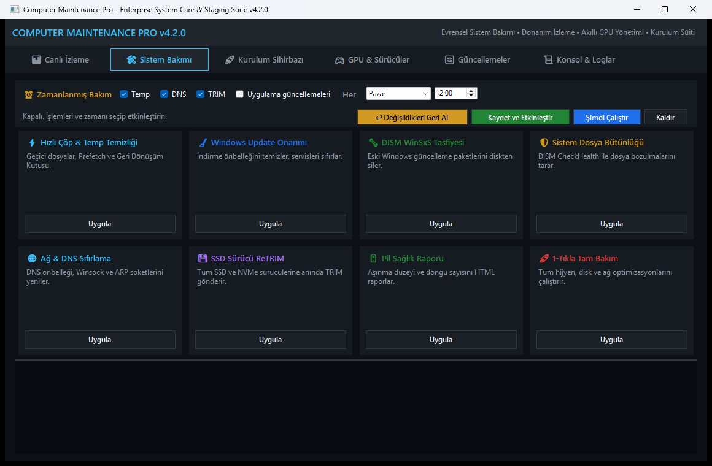
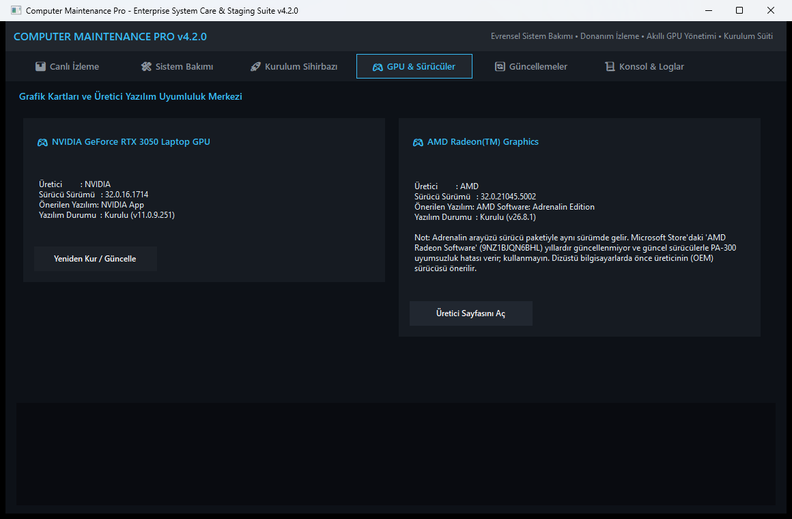
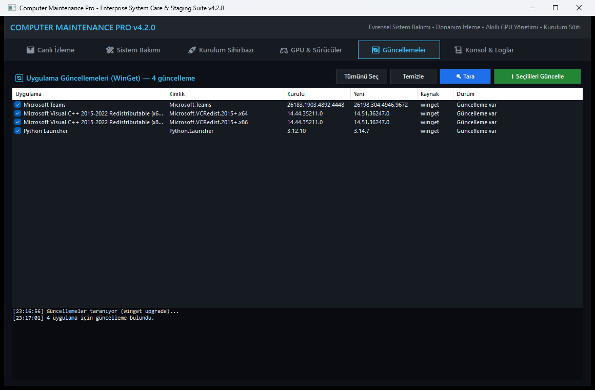

<h1 align="center">Computer Maintenance Pro</h1>

<p align="center">
  Windows 10 / 11 için <b>kurulum sonrası hazırlık</b>, <b>sistem bakımı</b> ve <b>donanım izleme</b> — tek pencereden.
</p>

<p align="center">
  
  
  
</p>

<p align="center"></p>

## Neler yapar?

- **Yeni Windows'u dakikalar içinde hazırlar.** Kurulum sihirbazı 13 adımı sırayla çalıştırır: temel ayarlar, çalışma
  zamanları (.NET, VC++), sürücüler, uygulamalar, ağ ve güvenlik. Gerekirse yeniden başlatır ve **kaldığı yerden devam eder**.
- **Bakımı tek tıkla yapar.** Geçici dosyalar, Windows Update önbelleği, DISM onarımı, ağ sıfırlama, SSD TRIM, pil raporu —
  ister elle, ister **haftalık zamanlanmış görev** olarak.
- **Donanımı canlı izler.** İşlemci, ekran kartı (NVIDIA için sıcaklık ve VRAM), bellek, disk ve pil; 2 saniyede bir.
- **Ekran kartınıza uygun yazılımı bilir.** NVIDIA App, AMD Adrenalin gibi üretici yazılımlarını önerir ve kurar.
- **Uygulamalarınızı güncel tutar.** `winget` ile güncellemesi olan uygulamaları listeler, seçtiklerinizi günceller.
- **Geri alınabilir.** Başlamadan önce Sistem Geri Yükleme Noktası alır; değiştirdiği her ayarı önceki değeriyle kaydeder ve
  tek tıkla geri almanızı sağlar.

## Ekran görüntüleri

| Kurulum Sihirbazı | Sistem Bakımı |
| :---: | :---: |
|  |  |
| **GPU & Sürücüler** | **Güncellemeler** |
|  |  |

## İndirme ve kullanım

1. [Sürümler (Releases)](https://github.com/Ygterygt/PostInstall/releases) sayfasından
   `ComputerMaintenancePro-vX.Y.Z.zip` dosyasını indirin.
2. Zip'e **sağ tıklayın → Özellikler → "Engellemeyi kaldır"**, sonra istediğiniz bir klasöre çıkarın.
3. **`PostInstall.exe`**'yi çalıştırın ve yönetici iznini onaylayın.

Kurulum gerekmez; program bulunduğu klasörden (USB bellek dahil) çalışır. Ayrıntılar: [Kullanım Kılavuzu](docs/KULLANIM.md) ·
[Değişiklik Günlüğü](CHANGELOG.md)

> **"Windows bilgisayarınızı korudu" uyarısı:** Program henüz dijital olarak imzalı olmadığı için görünebilir.
> **Ek bilgi → Yine de çalıştır** ile devam edin.

### Kendi yükleyicileriniz

`Installers\` klasörüne koyduğunuz `.exe` / `.msi` / `.msix` dosyalarını sihirbaz **sessizce** kurar
(MSI, Inno Setup, NSIS, WiX, InstallShield… türünü kendisi tanır). Aynı ya da daha yeni sürüm kuruluysa atlar,
eski sürüm kuruluysa günceller. NVIDIA ve AMD'nin resmi sürücü paketleri de bu yolla güncellenir.

## Güvenlik ilkeleri

- Varsayılan ayarlar yıkıcı değildir: Geri Dönüşüm Kutusu boşaltılmaz, olay günlükleri silinmeden önce arşivlenir,
  DNS yalnızca otomatik (DHCP) ağlarda ve etki alanına katılmamış bilgisayarlarda değiştirilir. Hepsi `config.json`'dan ayarlanır.
- İnternetten indirilen kurulum dosyaları **geçerli dijital imza olmadan çalıştırılmaz**.
- Kayıtlar ve raporlar `C:\ProgramData\ComputerMaintenancePro` altında tutulur; program klasörüne yazılmaz.

## Gereksinimler

- Windows 10 veya 11 (64 bit), yönetici hesabı
- Windows PowerShell 5.1 (Windows ile birlikte gelir)
- İnternet bağlantısı yalnızca uygulama kurulumu ve güncellemeleri için gerekir

## Geliştiriciler için

Mimari, dosya haritası, test komutları ve bu projede yaşanmış PowerShell tuzakları [AGENTS.md](AGENTS.md)'de;
yol haritası [docs/ROADMAP.md](docs/ROADMAP.md)'de.

```powershell
# Test bataryası (sistemi değiştirmez; çıkış kodu = başarısız test sayısı)
powershell -NoProfile -ExecutionPolicy Bypass -File .\Test-PostInstallSuite.ps1

# Son kullanıcı paketi (dist\ altına zip + SHA256)
powershell -NoProfile -ExecutionPolicy Bypass -File .\Tools\New-ReleasePackage.ps1
```

Yeni sürüm: `config.json` → `Version` ve `CHANGELOG.md` güncellenir, main'e birleştirilir, `vX.Y.Z` etiketi gönderilir;
GitHub Actions paketi üretip sürümü yayınlar.
